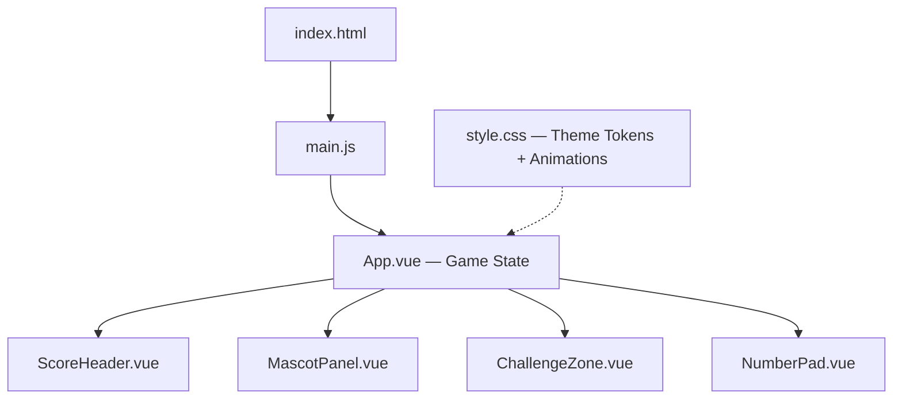

# Emma's Math Quest — Walkthrough

A mobile-first, Minecraft-inspired math game built with **Vue 3 + Vite + Tailwind CSS v4**, designed for a 6-year-old.

## Architecture



## Phase 2 Additions

### New Files
| File | Purpose |
|------|---------|
| [useSound.js](file:///Users/hector/Developer/EmmaApp/src/composables/useSound.js) | Web Audio API composable — synthesizes correct/wrong/tap/streak sounds with no external files |
| [ConfettiBurst.vue](file:///Users/hector/Developer/EmmaApp/src/components/ConfettiBurst.vue) | 40-particle CSS confetti burst on correct answers |

### Key Upgrades
| Feature | Details |
|---------|---------|
| **Confetti** | 40 particles (★●■◆▲) in palette colors, CSS-animated with randomized trajectories |
| **Sound** | 4 synthesized effects via Web Audio API: ascending arpeggio (correct), low buzz (wrong), soft click (tap), fanfare (streak milestone) |
| **Mute Toggle** | 🔊/🔇 button in header, global state via composable |
| **Adaptive Difficulty** | Rolling 10-answer window, targets 80% success rate, auto-adjusts operand range (3–20) |
| **Rolling Star Count** | `roll-in` animation with spring easing on score increment |
| **Problem Pop-In** | `pop-in` scale animation when new problems appear |
| **Button Spring** | Enhanced `btn-press` with cubic-bezier spring curve |
| **Reduced Motion** | `@media (prefers-reduced-motion: reduce)` disables all animations |

---

## Files Created / Modified (All Phases)

| File | Purpose |
|------|---------|
| [vite.config.js](file:///Users/hector/Developer/EmmaApp/vite.config.js) | Added `@tailwindcss/vite` plugin |
| [index.html](file:///Users/hector/Developer/EmmaApp/index.html) | SEO, Outfit font, mobile viewport |
| [style.css](file:///Users/hector/Developer/EmmaApp/src/style.css) | Tailwind v4 `@theme` with Minecraft tokens + animations |
| [App.vue](file:///Users/hector/Developer/EmmaApp/src/App.vue) | Game state, problem generation, answer checking |
| [ScoreHeader.vue](file:///Users/hector/Developer/EmmaApp/src/components/ScoreHeader.vue) | Stars count, title, streak badge |
| [MascotPanel.vue](file:///Users/hector/Developer/EmmaApp/src/components/MascotPanel.vue) | Fox mascot with float animation + speech bubble |
| [ChallengeZone.vue](file:///Users/hector/Developer/EmmaApp/src/components/ChallengeZone.vue) | Problem display with answer box + feedback effects |
| [NumberPad.vue](file:///Users/hector/Developer/EmmaApp/src/components/NumberPad.vue) | Touch-friendly 0-9 pad, backspace, GO! button |
| `src/assets/mascot.png` | AI-generated pixel-art fox wizard mascot |

## Design System

### Minecraft-Inspired Palette
- **Greens** — `mc-grass` (#5D8C3E), `mc-grass-light` (#7EC850), `mc-leaf` (#4A7A2E)
- **Earth** — `mc-dirt` (#8B6914), `mc-wood` (#6B4226), `mc-sand` (#E8D5A3)
- **Purples** — `mc-purple` (#9B30FF), `mc-purple-dark` (#6A1B9A), `mc-purple-glow` (#CE93D8)
- **Accents** — `mc-gold` (#FFD700), `mc-red` (#D32F2F)

### Accessibility
- All buttons ≥ 60px tall with generous padding
- Text sizes: 3xl–7xl (no small text anywhere)
- High-contrast color pairs throughout
- `user-scalable=no` for kiosk-like experience on mobile
- Semantic HTML with `aria-label` on interactive elements

### Animations
| Animation | Used For |
|-----------|----------|
| `star-bounce` | Star count on increment |
| `animate-float` | Mascot idle bobbing |
| `pulse-glow` | Correct answer celebration |
| `shake` | Wrong answer feedback |
| `btn-press` | Button tap feedback |

## Screenshots

### Mobile View (390×844)
````carousel

<!-- slide -->

````

### Tablet View (768×900)


### Phase 2 Gameplay Demo


## Running the App

```bash
cd /Users/hector/Developer/EmmaApp
npm run dev
# → http://localhost:5173/
```

## Game Logic Summary
- **Addition**: both operands 1–10
- **Subtraction**: operand A ≥ operand B (no negatives)
- Correct → ⭐ +1, streak +1, auto-advance after 1.2s
- Wrong → shake, streak reset, try again after 0.9s
- Streak ≥ 2 → 🔥 badge appears in header
